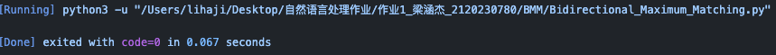
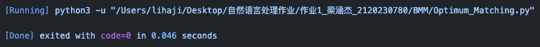

# 中文分词算法


Project Tree
```
Chinese_segmentation_algorithm
├─ Bidirectional_Maximum_Matching.py 双向最大匹配
├─ Optimum_Matching.py 最优匹配
├─ README.md 
├─ asserts 
├─ corpuswordlist.dict.yaml 词典
├─ output.txt 输出文件
├─ text.txt 待分词文本
├─ tools
└─ update

```
运行时间
- 双向最大匹配

- 最优匹配


## 最大匹配法
### 正向最大匹配法 FMM
 ```python
 def FMM(text,word_dict):
    res = ""
    # 令 length 的初始值等于词典中最大的词的长度
    max_length = max(len(word) for word in word_dict)
    length = max_length

    while(text!=""):
        w = text[0:length]
        if(w in word_dict):
            text = text[length:]
            res += w+" "
            length = max_length
        else:
            if length ==1 :
                text = text[length:]
                res += w+" "
                length = max_length

            else:
                length-=1
    return res
 ```


### 逆向最大匹配法 BMM
```python
def BMM(text,word_dict):
    res = ""
    # 令 length 的初始值等于词典中最大的词的长度
    max_length = max(len(word) for word in word_dict)
    length = max_length

    while(text!=""):
        # 从字符串的末尾取 长度为 len 的子串 w
        w = text[-length:]

        if(w in word_dict):
            text = text[:-length]
            res = w+" "+res
            length = max_length
        else:
            if length ==1 :
                text = text[:-length]
                res = w+" "+res
                length = max_length

            else:
                length-=1
    return res
```


最大匹配分词寻找最优组合的方式是将匹配到的最长词组合在一起


算法流程如下：

1. 选择一个固定的最大词长（通常是词典中最长词语的长度）。
2. 从待分词文本的起始位置开始，向后扫描，选择与最大词长匹配的词语。
3. 同时，从文本的末尾开始，向前扫描，选择与最大词长匹配的词语。
4. 选择匹配得最长的那个词语，并将其划分出来，将其从待分词文本中去掉。
5. 重复步骤2-4，直到待分词文本为空。


## 最优匹配法
先对词典按照词频排序，然后再使用双向最大匹配
