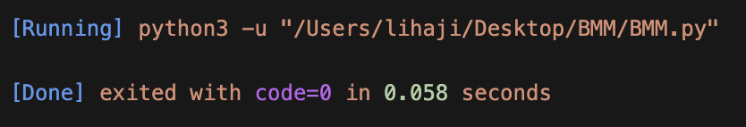

# 双向最大匹配法


Project Tree
```
BMM
├─ BMM.py --代码
├─ README.md
├─ corpuswordlist.dict.yaml --字典
├─ output.txt --分词结果
├─ text.txt --需要分词的文本
└─ update

```
运行时间



## 最大匹配法
### 正向匹配法


### 逆向匹配法


最大匹配分词寻找最优组合的方式是将匹配到的最长词组合在一起

先将词典构造成一棵Trie树


双向最大匹配法（Bidirectional Maximum Match, BMM）是一种用于中文分词的常见算法。它的主要思想是从待分词的文本中同时从前向后和从后向前进行扫描，选择最长的匹配词语作为分词结果。

算法流程如下：

1. 选择一个固定的最大词长（通常是词典中最长词语的长度）。
2. 从待分词文本的起始位置开始，向后扫描，选择与最大词长匹配的词语。
3. 同时，从文本的末尾开始，向前扫描，选择与最大词长匹配的词语。
4. 选择匹配得最长的那个词语，并将其划分出来，将其从待分词文本中去掉。
5. 重复步骤2-4，直到待分词文本为空。
